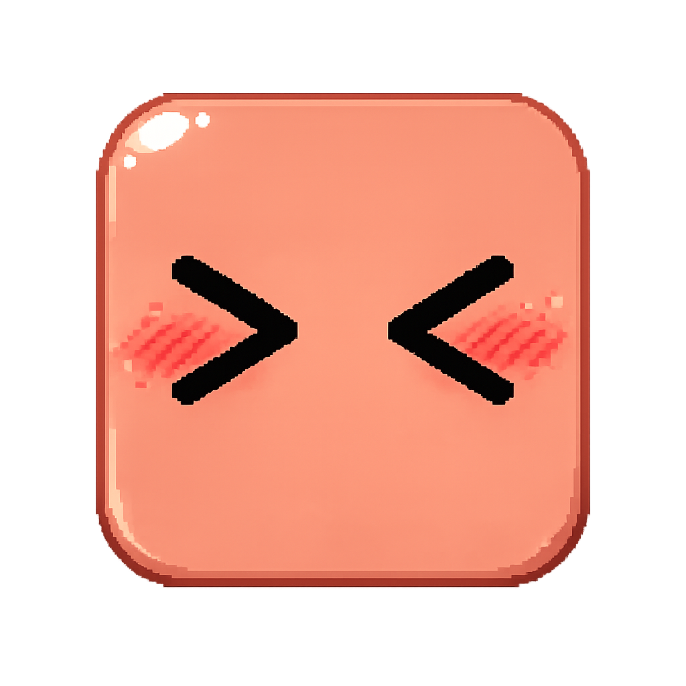

<p align="center">
  
</p>
<h1 align="center">Clyde on Desk</h1>
<p align="center">
  A desktop pet that mirrors your AI coding agent in real time
  <br>
  <a href="README.zh-CN.md">中文版</a>
</p>
<p align="center">
  
  
  
  
  
</p>

Clyde sits on your desktop and reflects what your AI coding agent is doing: thinking when you prompt, typing when tools run, juggling subagents, popping permission bubbles, celebrating on completion, and sleeping when you step away.

Works with **Claude Code**, **Codex CLI**, and **Copilot CLI** — all three can run simultaneously.

## Quick Start

```bash
git clone https://github.com/QingJ01/Clyde.git
cd Clyde
npm install
npm start        # Tauri dev mode with hot-reload
```

**Prerequisites** — [Node.js](https://nodejs.org/) v18+, [Rust](https://rustup.rs/) stable, and [Tauri prerequisites](https://v2.tauri.app/start/prerequisites/) for your platform.

**Agent setup** — all zero-config:
- **Claude Code** — hooks auto-registered on launch (command hooks + HTTP permission hook)
- **Codex CLI** — log polling starts automatically (`~/.codex/sessions/`)
- **Copilot CLI** — auto-configured when `~/.copilot` exists

## Features

### Animations

12 animated states driven by real-time agent events:

| Agent Event | Clyde Does | SVG |
|---|---|---|
| Idle | Follows your cursor (eye tracking + body lean) | `clyde-idle-follow` |
| UserPromptSubmit | Thinking | `clyde-working-thinking` |
| PreToolUse | Typing | `clyde-working-typing` |
| 3+ sessions active | Building | `clyde-working-building` |
| 1 subagent | Juggling | `clyde-working-juggling` |
| 2+ subagents | Conducting | `clyde-working-conducting` |
| PostToolUseFailure | Error flash | `clyde-error` |
| Stop (task complete) | Happy bounce | `clyde-happy` |
| Notification | Alert jump | `clyde-notification` |
| PreCompact | Sweeping | `clyde-working-sweeping` |
| WorktreeCreate | Carrying box | `clyde-working-carrying` |
| 60s no activity | Yawn → doze → collapse → sleep | `clyde-sleeping` |

### Interaction

- **Drag** anywhere, anytime — Pointer Capture prevents fast-flick drops
- **Double-click** for a poke reaction; **4 clicks** for a flail
- **Right-click** context menu — session list, DND, mini mode, size, language
- **System tray** — resize (S/M/L), DND, mini mode, language, auto-start, quit

### Mini Mode

Drag Clyde to the left or right screen edge (or right-click "Mini Mode"). Clyde hides behind the edge, peeks out on hover, and shows mini alerts/celebrations while tucked away.

### Permission Bubbles

When Claude Code requests tool permissions, Clyde pops a floating card — allow, deny, or apply a suggestion rule (e.g. "Always allow Read"). Multiple requests stack upward. If you answer in the terminal first, the bubble auto-dismisses.

### Session Intelligence

- **Multi-session priority** — the highest-priority state across all sessions wins
- **Subagent-aware** — 1 subagent = juggling, 2+ = conducting
- **Terminal focus** — right-click a session to jump to its terminal
- **Auto-cleanup** — stale sessions removed after 10 min; working states demoted after 5 min
- **DND mode** — silences all events; toggle via right-click or tray

## Architecture

```
src-tauri/src/           Rust backend
├── lib.rs               App entry + Tauri commands
├── state_machine.rs     Multi-session state tracking + priority
├── http_server.rs       Axum HTTP (POST /state, /permission)
├── hooks.rs             Hook deployment + settings.json registration
├── permission.rs        Permission bubble windows
├── mini.rs              Edge snap, peek, parabolic jump
├── tick.rs              50ms cursor poll (eyes, sleep, peek)
├── tray.rs              System tray menu
├── windows.rs           Window bounds + hit-test math
├── focus.rs             Terminal focus by PID (Win/Mac/Linux)
├── codex_monitor.rs     Codex JSONL log polling
├── prefs.rs             Preferences persistence
└── i18n.rs              English / Chinese strings

src/windows/             Svelte 5 frontend (3 windows)
├── pet/                 SVG renderer
├── hit/                 Invisible click layer
└── bubble/              Permission card

hooks/                   JS hooks (embedded at compile time)
├── clyde-hook.js        Claude Code command hook
├── server-config.js     Port discovery
├── auto-start.js        Auto-launch on SessionStart
├── copilot-hook.js      Copilot CLI hook
└── install.js           Manual hook registration CLI

assets/svg/              35 animation frames
```

## Tech Stack

| Layer | Technology | Why |
|---|---|---|
| **Desktop framework** | [Tauri v2](https://v2.tauri.app/) | ~5 MB bundle (vs 150 MB+ for Electron); native OS APIs (transparent windows, tray, global shortcuts); Rust backend calls with zero IPC serialization overhead |
| **Backend** | [Rust](https://www.rust-lang.org/) | No GC, zero-cost abstractions; 50 ms timer + multi-session state machine in a single process with near-zero CPU; `Mutex` + `Arc` for thread safety by default |
| **Frontend** | [Svelte 5](https://svelte.dev/) | Compile-time, no virtual DOM — three windows total < 30 KB JS; `$state` / `$props` reactivity keeps SVG rendering logic minimal |
| **HTTP server** | [Axum](https://github.com/tokio-rs/axum) | Async web framework on Tokio; type-safe routing + extractors; shares the same Tokio runtime as Tauri — no extra thread pool |
| **Build tool** | [Vite](https://vitejs.dev/) | Instant HMR in dev; aggressive tree-shaking in production |

**Why this stack:** Rust owns all state logic and system interaction, Svelte is a razor-thin rendering layer, and Tauri glues them into a < 10 MB cross-platform desktop app. No runtime interpreter (Node.js, Python, etc.) — cold start < 1 s, resident memory < 30 MB.

## Known Limitations

| Limitation | Details |
|---|---|
| Codex: no terminal focus | JSONL polling doesn't carry terminal PID |
| Copilot: no permission bubble | Copilot's hook protocol only supports deny |
| HTTP server is unauthenticated | Binds `127.0.0.1` only; token auth planned |
| No auto-update | Download new versions from GitHub Releases |

## Contributing

Issues, ideas, and PRs welcome — [open an issue](https://github.com/QingJ01/Clyde/issues) or submit a PR.

```bash
npm test             # cargo test (19 unit tests)
```

### Contributors

<table>
  <tr>
    <td align="center"><a href="https://github.com/QingJ01"><br /><sub><b>QingJ01</b></sub><br /><sub>Core Contributor</sub></a></td>
    <td align="center"><a href="https://github.com/rullerzhou-afk"><br /><sub><b>rullerzhou-afk</b></sub><br /><sub>Original Project Author</sub></a></td>
    <td align="center"><a href="https://github.com/PixelCookie-zyf"><br /><sub><b>PixelCookie-zyf</b></sub><br /><sub>Original Contributor</sub></a></td>
    <td align="center"><a href="https://github.com/yujiachen-y"><br /><sub><b>yujiachen-y</b></sub><br /><sub>Original Contributor</sub></a></td>
    <td align="center"><a href="https://github.com/AooooooZzzz"><br /><sub><b>AooooooZzzz</b></sub><br /><sub>Original Contributor</sub></a></td>
    <td align="center"><a href="https://github.com/purefkh"><br /><sub><b>purefkh</b></sub><br /><sub>Original Contributor</sub></a></td>
  </tr>
  <tr>
    <td align="center"><a href="https://github.com/Tobeabellwether"><br /><sub><b>Tobeabellwether</b></sub><br /><sub>Original Contributor</sub></a></td>
    <td align="center"><a href="https://github.com/Jasonhonghh"><br /><sub><b>Jasonhonghh</b></sub><br /><sub>Original Contributor</sub></a></td>
    <td align="center"><a href="https://github.com/crashchen"><br /><sub><b>crashchen</b></sub><br /><sub>Original Contributor</sub></a></td>
    <td align="center"><a href="https://github.com/hongbigtou"><br /><sub><b>hongbigtou</b></sub><br /><sub>Original Contributor</sub></a></td>
    <td align="center"><a href="https://github.com/InTimmyDate"><br /><sub><b>InTimmyDate</b></sub><br /><sub>Original Contributor</sub></a></td>
    <td align="center"><a href="https://github.com/NeizhiTouhu"><br /><sub><b>NeizhiTouhu</b></sub><br /><sub>Original Contributor</sub></a></td>
  </tr>
</table>

## Acknowledgments

- Forked from [Clawd on Desk](https://github.com/rullerzhou-afk/clawd-on-desk) by [@rullerzhou-afk](https://github.com/rullerzhou-afk) — the original Clawd desktop pet project that inspired Clyde
- Clyde pixel art reference from [clyde-tank](https://github.com/marciogranzotto/clyde-tank) by [@marciogranzotto](https://github.com/marciogranzotto)
- The Clyde character ("ClawdWizard") is a community creation. This project is not officially affiliated with or endorsed by [Anthropic](https://www.anthropic.com).

## License

[AGPL-3.0](LICENSE)
